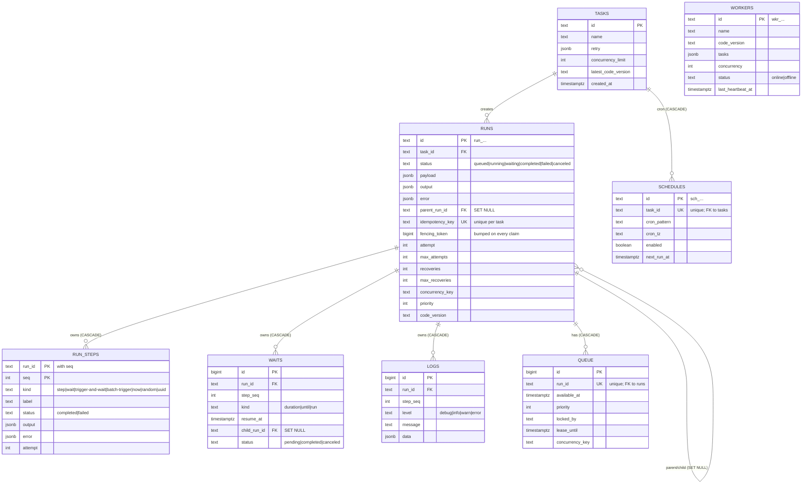

# Database

One Postgres database holds everything: the queue, run ledgers, step memory,
waits, logs, schedules and the worker registry. The schema is defined in
`packages/db` with Drizzle and applied as generated SQL migrations — daemons
auto-migrate at boot (`--no-migrate` to disable).

## Tables



Key design points:

- **`fencing_token` lives on `runs`, not on the queue row.** The queue row is
  deleted and recreated on retry/resume, but the token must be monotonic for
  the run's whole life.
- **FK behavior is deliberate.** `runs.parent_run_id` and `waits.child_run_id`
  are `ON DELETE SET NULL` (a deleted child must not cascade-kill a running
  parent); `run_steps` / `waits` / `logs` / `queue` cascade from `runs`, so any
  delete path (prune, CLI, manual `psql`) leaves no orphans.
- **`queue.locked_by IS NULL` is the only "not occupied" test** — not
  `locked_at`. Expired leases are the reaper's job alone; claim and reaper
  candidate sets are disjoint.
- **Two partial indexes** keep the hot scans narrow:
  - `queue_claimable_idx (priority DESC NULLS FIRST, id) WHERE locked_by IS NULL`
  - `queue_lease_until_idx (lease_until) WHERE lease_until IS NOT NULL`

## The claim query

Claiming is one transaction, and one SQL statement pulls every column a run
needs (payload, attempts, versions, concurrency limits) to avoid N+1:

```sql
SELECT q.id AS queue_id, q.run_id,
       r.task_id, r.payload, r.attempt, r.max_attempts,
       r.code_version, r.env, r.concurrency_key,
       t.concurrency_limit
  FROM queue q
  JOIN runs r ON r.id = q.run_id
  LEFT JOIN tasks t ON t.id = r.task_id
 WHERE q.available_at <= now() AND q.locked_by IS NULL
   AND r.task_id = ANY($1::text[])   -- the tasks THIS worker registered
 ORDER BY q.priority DESC, q.id ASC
 LIMIT $2                            -- claimWindow = max(limit * 2, 10)
 FOR UPDATE OF q SKIP LOCKED
```

The task filter lives **in SQL**, so a worker that registered two tasks never
wastes its candidate window on someone else's queue head. Task-level
code-version pinning (`--pin-code-version`) extends the filter to `(id,
version)` pairs, so a mid-flight edit never hands a run to code that cannot
replay its ledger.

## Retention

The engine never deletes history unless you ask:

- `--retention 30d` turns on an hourly GC of terminal runs (steps and logs
  cascade) and offline worker rows.
- `better-trigger-worker prune --older-than 30d [--dry-run]` is the one-shot
  form.

Non-terminal runs are never deleted at any age — a stuck run is a bug to look
at, not garbage.
