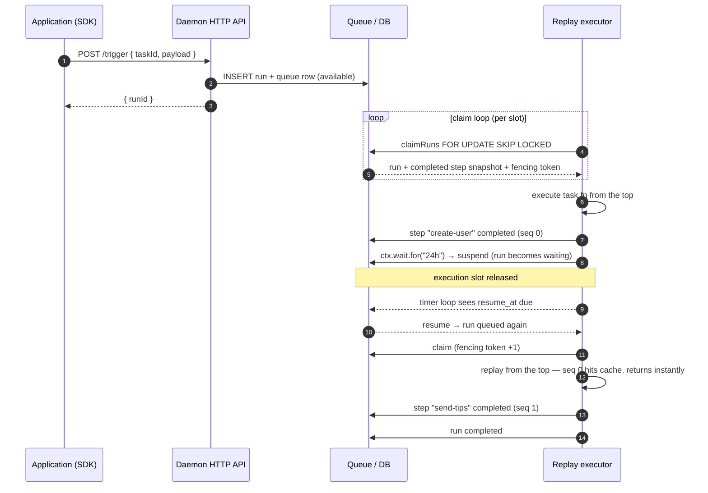
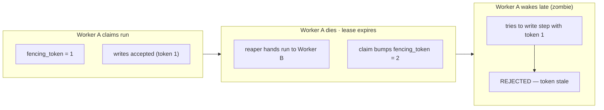

# Durable execution

better-trigger uses **step-memory replay**: completed steps are memoized in
Postgres, and after a crash or a long wait the task function re-runs from the
top with cached steps returning instantly. There are no container snapshots and
no serialized call stacks.

## The replay lifecycle

Every `ctx.step` / `wait` / `triggerAndWait` / `batchTrigger` / `now` /
`random` / `uuid` consumes a **positional sequence number**. When execution
reaches a `seq` that has a completed row in the snapshot, the cached output is
returned instead of re-running the function.

- A `status='failed'` row is treated as not-done (retries re-execute and
  upsert over it).
- **Drift detection:** a cache hit is validated against the call site. A `kind`
  mismatch (e.g. a wait row landing on a `ctx.step`) is a hard failure; a pure
  `label` rename is the one soft exemption.
  - `replay: 'lenient'` (default) — warns and uses the cached row.
  - `replay: 'strict'` — terminal `AbortError`, no retry.

## Waits free the slot

When a task calls `ctx.wait.for(...)`, the runtime writes a `waits` row, marks
the run `waiting`, deletes its queue row and **releases the execution slot**.
A timer loop (1s tick) scans due waits, and under the standard lock order
(queue → runs → wait) marks them completed, writes the step row, and re-queues
the run. The slot is freed for other work — that is why a single daemon can
sleep thousands of waits.

## Crash safety: leases + fencing

Every claim returns a **fencing token** — a per-run monotonic counter bumped on
claim. Every write-back from the executor must carry the token it was given; a
late write from a dead worker arrives with a stale token and is rejected with
`409 stale_lease`. Step history stays exactly-once even through a `kill -9`.

## Multi-daemon coordination

N daemons share one database with no leader election. All coordination happens
through Postgres row locks:

- **Claim** — a single `SELECT ... FOR UPDATE OF q SKIP LOCKED` transaction
  picks available queue rows, filtered by the tasks this worker registered.
- **Concurrency limits** — a transaction-scoped advisory lock per
  `concurrency_key` plus a running-count check serializes the "am I over the
  limit?" decision.
- **Lease reaper** — every 10s sweeps the oldest expired leases (`SKIP LOCKED`,
  bounded batch) and hands the runs back to the queue, costing one `recovery`.
- **Graceful shutdown** — instead of waiting for the visibility timeout, the
  daemon returns its own claims (`locked_by = NULL`) and marks itself offline.
  `attempt` and `fencing_token` are untouched.

## Two budgets, separately

- `attempt / maxAttempts` — the budget for **your code** failing; only the
  fail/retry path spends it.
- `recoveries / maxRecoveries` — the budget for **infrastructure** takeovers
  (deploys, OOM, machine sleep); only the reaper spends it.

A lost worker's run is resumed on the **same attempt** using its ledger — a
deploy never burns your retry budget. Exhausting `max_recoveries` terminates
with `worker lost`; exhausting attempts terminates with your own error.

## Determinism is a contract

Code between steps re-runs on every replay, so it must be deterministic. Use
`ctx.step` for side effects and `ctx.now()` / `ctx.random()` / `ctx.uuid()` for
time and randomness — all three are memoized mini-steps whose recorded values
come back on replay.
