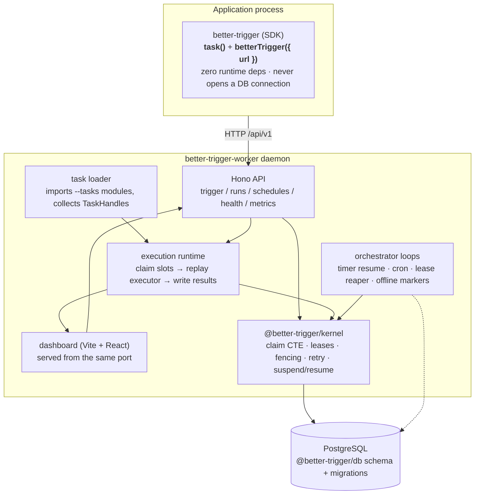
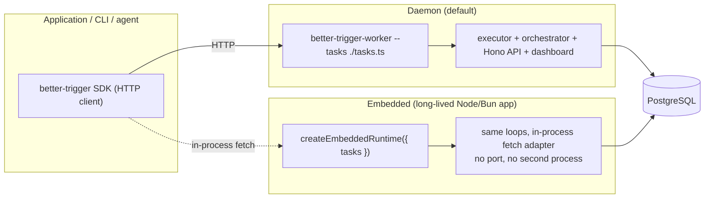

# Architecture overview

better-trigger's design can be summed up in one sentence:

> **The application triggers tasks over HTTP; the worker runtime owns Postgres
> and does everything else.** The SDK is a zero-dependency HTTP client; the
> daemon (or an embedded host) owns the queue, the orchestrator loops and the
> replay executor. Postgres is the only infrastructure.

## The client / daemon split

The whole package layout exists to make one boundary true: an application that
just wants to `await hello.trigger(...)` should not get a database connection
pool and a full execution loop in its dependency tree — and `pg` should never
appear in the dependency tree of a package that just triggers tasks.



Only `apps/worker`, `packages/kernel` and the private test harness import `pg`.
That boundary is enforced by `check:deps` in CI: `core` and the SDK can never
grow a runtime dependency.

## Two ways to host the runtime

The same runtime runs either as the standalone daemon or embedded in a
long-lived application — one execution model, two deployment shapes.



## Process model

- **Single process (default):** one daemon = execution + orchestration + API +
  dashboard.
- **Single process (embedded):** the host calls `createEmbeddedRuntime`; the
  SDK reuses the same Hono routes through an in-process fetch adapter. One
  embedded runtime per process.
- **Multi-process:** N daemons share one Postgres. Every claim and scan uses
  `FOR UPDATE SKIP LOCKED` — no leader election. `--no-serve` gives a pure
  executor node; no `--tasks` gives a pure API/dashboard node.
- **Honest downtime:** when no runtime host is online, state is saved but no
  timer/cron/step executes. Missed cron windows are not back-filled.

## Semantics at a glance

| Capability | Commitment |
|---|---|
| Run state | Rebuilt from payload + memoized steps + deterministic code; call stacks are never serialized |
| Step result history | Exactly-once (`(run_id, seq)` unique + fencing) |
| Step execution (side effects) | **At-least-once**; use `idempotencyKey` where exactly-once side effects matter |
| Wait / timer | Deadline persisted; runs when a daemon is online, wakes at most once |
| Daemon crash | Any surviving daemon takes over after the lease expires; late writes from the zombie are fenced out |
| Takeover cost | Costs a run's `recoveries` (default max 10), **not** an `attempt` |
| All daemons down | State is saved; nothing executes until a daemon returns |

## Package layout

```
apps/
  worker/           @better-trigger/worker — the daemon (loader + executor +
                    orchestrator + Hono API), bin better-trigger-worker,
                    subpath @better-trigger/worker/embedded
  web/              dashboard (Vite + React)
  docs/             this site (VitePress)
packages/
  sdk/              better-trigger — task() + ctx types + HTTP client.
                    Zero runtime deps. better-trigger/internal is the daemon's
                    private seam (ALS + definition adapter), not public API
  core/             shared types / errors / duration / backoff. Zero runtime deps
  kernel/           @better-trigger/kernel — the PG engine (internal package)
  db/               drizzle schema / migrations / pool
  testing/          private harness: scenario runner, per-scenario databases
examples/
  basic/            example tasks + the acceptance scenarios
```

## A subtle detail: the process-wide registry

`ctx` detection ("am I inside a running task?") uses `AsyncLocalStorage`. The
daemon and your task modules may resolve **two copies** of `better-trigger`
(different `node_modules` trees), which would break module-scoped ALS — visible
as `triggerAndWait()` throwing "must be called inside a running task" from
inside a run.

So ALS, the default client and the `result()` resolver all hang off
`globalThis[Symbol.for('better-trigger.registry.v1')]`. However many copies of
the SDK exist, they share one registry.

## Roadmap

See [Roadmap](./roadmap) for the phase plan (P1–P6), and
[Database](./database) for the schema. The authoritative engineering notes
live in the repo under [`docs/architecture.md`](https://github.com/zhy0216/better-trigger/blob/main/docs/architecture.md)
and [`docs/backend-contract.md`](https://github.com/zhy0216/better-trigger/blob/main/docs/backend-contract.md).
