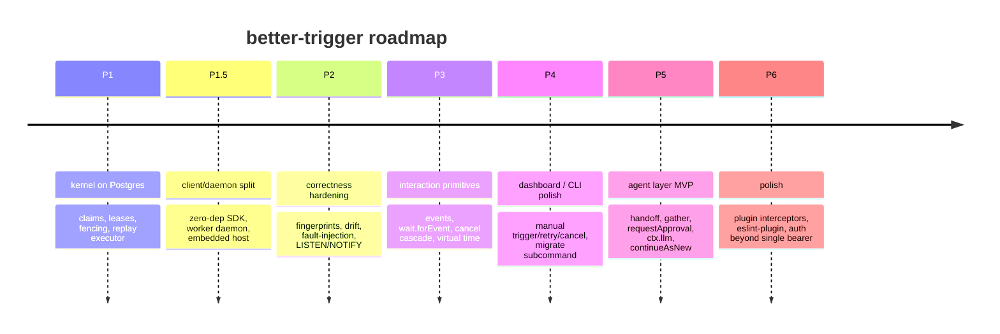

# Roadmap

The engineering plan is tracked as phases **P1–P6** in
[`docs/architecture.md`](https://github.com/zhy0216/better-trigger/blob/main/docs/architecture.md).
This page is the public summary.

## Where we are

**Implemented and shipped:**

- Task/step replay with positional seq keys
- Queue with `FOR UPDATE SKIP LOCKED`, persistent leases, monotonic fencing
  tokens (exactly-once step history)
- Retries with backoff · idempotency keys · `AbortError`
- `ctx.wait.for` / `wait.until` suspend-resume
- `triggerAndWait` (parent/child) · `batchTrigger` (fan-out)
- Cron scheduling (DB clock based) · concurrency limits
- Crash recovery (`recoveries` budget, `worker lost` terminal state)
- Client/daemon split: zero-dependency SDK as an HTTP client
- Embedded host (`createEmbeddedRuntime`)
- Step fingerprints + drift detection (`replay: 'lenient' | 'strict'`)
- Code version stamping + `--pin-code-version` (stranded-run detection)
- Notification fast-path (`pg_notify` on the `bt` channel)
- Retention / prune · health + Prometheus metrics · built-in dashboard
- A large acceptance suite (e2e, fencing, replay-drift, crash, worker-lost,
  rolling-deploy, migration, notify, …) that runs on every PR

## Phases

### P2 — correctness hardening (in progress)

Fingerprints + `NonDeterminismError` are shipped, and so are the
`LISTEN/NOTIFY` wakeups (`pg_notify` on the `bt` channel — the notification
fast-path in the list above). Remaining:

- Crash / fault-injection harnesses at every persistence boundary (throw /
  abort / connection drop / duplicate delivery)

**Wakeup cost today** — notifications are the fast path and a latency
optimization only: every path below keeps its polling fallback, so a lost
notification costs at most one interval and never correctness.

| Path | Fast path + polling fallback |
|---|---|
| trigger → start executing | a `work` notification wakes the claim loops; otherwise the idle slot backs off 300ms → 2s (jittered) |
| `handle.result()` | a `terminal` notification settles every waiter for that run; otherwise one shared 1s sweep per daemon (was ~4 QPS per waiter) |
| wait expiry wake | 50 wakes/s global cap (1s tick, `LIMIT 50`, unlocked phase-1 scan); the re-enqueue it produces sends a `work` notification |
| cron fire | 50 fires/s, scales linearly with daemons (`SKIP LOCKED`); each fire sends a `work` notification |

### P3 — interaction primitives

`event()` / `emit` / `wait.forEvent` (atomic write + wake, offline-safe,
exactly-once consumption), cancel cascade (parent → child),
`batchTriggerAndWait` (fan-out/fan-in), virtual time in the testing package.

### P4 — dashboard / CLI polish

Manual trigger/retry/cancel already exist on the REST surface; `migrate`
subcommand and further polish.

### P5 — agent layer MVP

The first batch deliberately ships **three connection points + one step type**
(building on the signal/event kernel):

- `ctx.handoff` (controlled handover)
- `ctx.gather` (fan-out/fan-in on `batchTriggerAndWait`)
- `ctx.requestApproval` (human-in-the-loop on `wait.forEvent`)
- `ctx.llm` (memoized LLM steps — replay never re-invokes the model)
- `continueAsNew` (agent long loops without unbounded step ledgers)

**North-star demo:** a planner fans out 3 researchers → `gather` → a human
approval → a writer produces output. `kill -9` the daemon at any boundary;
after restart the LLM is never double-billed, the approval survives, the
history has no duplicate steps, and the result is correct.

### P6 — polish

Plugin interceptors (client/step/worker/persistence), an eslint-plugin for
determinism, live-query observability, and auth beyond a single bearer key.

## Design principles that survive all phases

1. The SDK stays a zero-dependency HTTP client — it never opens a database.
2. Postgres is the only v1 infrastructure; repositories are module boundaries,
   not public adapter APIs.
3. Replay by step memory (positional seq + memoized results) — not
   event-history or snapshots.
4. The dashboard is hosted by the daemon itself.
5. Agent primitives are a product layer built on the signal/event kernel.
