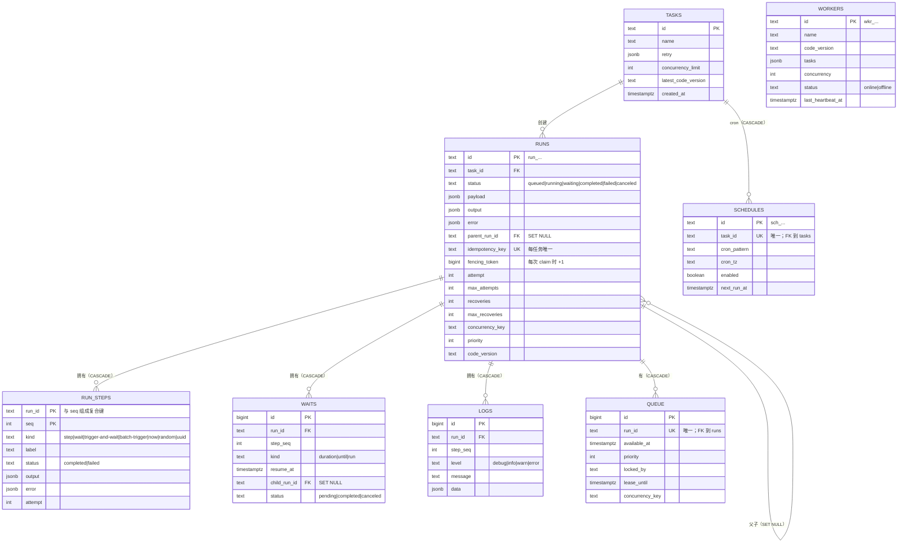

# 数据库

一个 Postgres 数据库装下所有东西：队列、run 账本、step 记忆、waits、日志、调度与 worker 注册表。schema 用 Drizzle 定义在 `packages/db`，以生成的 SQL 迁移应用——daemon 启动时自动迁移（可用 `--no-migrate` 关闭）。

## 表结构



关键设计点：

- **`fencing_token` 放在 `runs` 而不是 queue 行上。** queue 行在重试/恢复时会被删掉重建，但 token 必须在 run 的整个生命周期保持单调。
- **FK 行为是刻意的。** `runs.parent_run_id` 与 `waits.child_run_id` 是 `ON DELETE SET NULL`（删子 run 不能级联杀掉还在跑的父亲）；`run_steps` / `waits` / `logs` / `queue` 从 `runs` 级联删除，所以任何删除路径（prune、CLI、手工 `psql`）都留不下孤儿。
- **`queue.locked_by IS NULL` 是“未被占用”的唯一判据**——不是 `locked_at`。过期租约只归 reaper 处理；claim 与 reaper 的候选集不相交。
- **两个部分索引**让热扫描保持狭窄：
  - `queue_claimable_idx (priority DESC NULLS FIRST, id) WHERE locked_by IS NULL`
  - `queue_lease_until_idx (lease_until) WHERE lease_until IS NOT NULL`

## Claim 查询

claim 是一个事务，一条 SQL 就把 run 需要的所有列（payload、attempt、版本、并发上限）取回来，避免 N+1：

```sql
SELECT q.id AS queue_id, q.run_id,
       r.task_id, r.payload, r.attempt, r.max_attempts,
       r.code_version, r.env, r.concurrency_key,
       t.concurrency_limit
  FROM queue q
  JOIN runs r ON r.id = q.run_id
  LEFT JOIN tasks t ON t.id = r.task_id
 WHERE q.available_at <= now() AND q.locked_by IS NULL
   AND r.task_id = ANY($1::text[])   -- 这个 worker 注册的任务
 ORDER BY q.priority DESC, q.id ASC
 LIMIT $2                            -- claimWindow = max(limit * 2, 10)
 FOR UPDATE OF q SKIP LOCKED
```

任务过滤在 **SQL 里**，所以只注册了 2 个任务的 worker 不会把候选窗口浪费在别人的队头上。任务级代码版本钉死（`--pin-code-version`）把过滤扩展到 `(id, version)` 对，防止在途改动把 run 交给无法重放其账本的代码。

## 数据保留

未经要求，引擎从不删除历史：

- `--retention 30d` 开启每小时 GC，删除终态 run（step 与日志级联）与离线 worker 行。
- `better-trigger-worker prune --older-than 30d [--dry-run]` 是一次性形式。

非终态 run 无论多老都不会被删——卡住的 run 是要看的 bug，不是垃圾。
