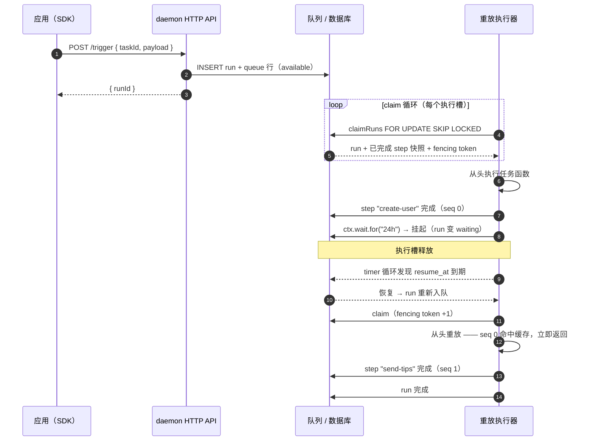
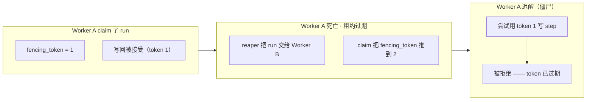

# 持久化执行

better-trigger 采用 **step 记忆重放**：已完成的 step 被记忆在 Postgres 里，崩溃或长时间 wait 之后任务函数从头重跑，命中的 step 立即返回缓存结果。没有容器快照，也没有序列化的调用栈。

## 重放生命周期

每个 `ctx.step` / `wait` / `triggerAndWait` / `batchTrigger` / `now` / `random` / `uuid` 都会消耗一个**位置序号（seq）**。执行到某个 `seq` 时若快照里已有 completed 行，直接返回缓存输出，不再执行函数。

- `status='failed'` 的行视为未完成（重试会重新执行并用新结果 upsert 覆盖）。
- **漂移检测：** 命中缓存前会把缓存行与调用点比对。`kind` 不一致（比如 wait 行落到 `ctx.step()` 上）是硬失败；纯 `label` 改名是唯一的软豁免。
  - `replay: 'lenient'`（默认）——警告并使用缓存行。
  - `replay: 'strict'`——终态 `AbortError`，不重试。

## wait 释放执行槽

任务调用 `ctx.wait.for(...)` 时，runtime 写入一条 `waits` 行、把 run 标记为 `waiting`、删除它的 queue 行并**释放执行槽**。timer 循环（1s tick）扫描到期的 wait，在标准锁序（queue → runs → wait）下把它们标记为 completed、写 step 行、重新入队。执行槽被释放去干别的活——这就是单个 daemon 可以休眠成千上万条 wait 的原因。

## 崩溃安全：租约 + fencing

每次 claim 都返回一个 **fencing token**——每条 run 的单调递增计数器，claim 时 +1。执行器每次写回都必须携带当初拿到的 token；死 worker 的迟到写会带着过期 token 到达，被 `409 stale_lease` 拒绝。即使经过 `kill -9`，step 历史依然 exactly-once。

## 多 daemon 协调

N 个 daemon 共享一个数据库，没有 leader 选举。所有协调都通过 Postgres 行锁完成：

- **Claim** —— 一条 `SELECT ... FOR UPDATE OF q SKIP LOCKED` 事务挑选可领取的 queue 行，按本 worker 注册的任务过滤。
- **并发限制** —— 每个 `concurrency_key` 一把事务级 advisory lock，加上 running 计数检查，串行化“我是不是超限了”这个决策。
- **Lease reaper** —— 每 10s 扫描最老的过期租约（`SKIP LOCKED`、有界批量），把 run 交还队列，消耗一次 `recovery`。
- **优雅关停** —— 不等可见性超时，daemon 直接归还自己名下的 claim（`locked_by = NULL`）并标记离线。`attempt` 与 `fencing_token` 都不动。

## 两本预算，分开记账

- `attempt / maxAttempts` —— **你的代码**失败的预算；只有失败/重试路径会花。
- `recoveries / maxRecoveries` —— **基础设施**接管的预算（部署、OOM、机器休眠）；只有 reaper 会花。

丢失 worker 的 run 会在**同一个 attempt** 上按账本继续——一次部署不会烧掉你的重试预算。`max_recoveries` 耗尽以 `worker lost` 终止；`attempt` 耗尽以你自己的错误终止。

## 确定性是契约

step 之间的代码每次重放都会重跑，所以它必须是确定性的。副作用请放进 `ctx.step`，时间与随机请用 `ctx.now()` / `ctx.random()` / `ctx.uuid()`——三者都是记忆化的迷你 step，重放时返回已记录的旧值。
