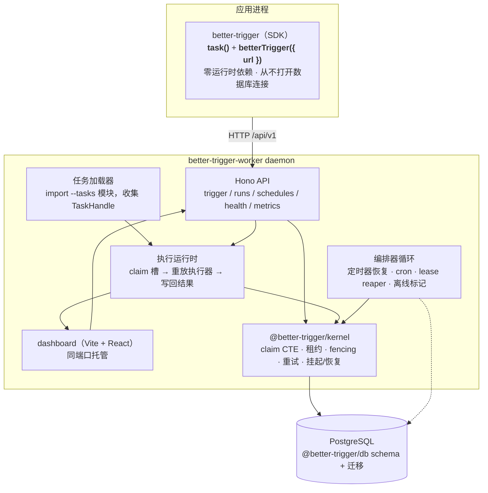
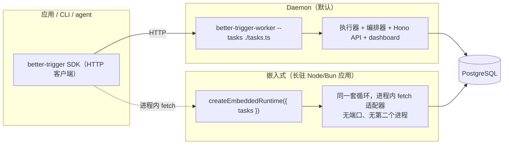

# 架构总览

better-trigger 的设计可以用一句话概括：

> **应用通过 HTTP 触发任务；worker runtime 独占 Postgres，其他一切都由它负责。** SDK 是一个零依赖的 HTTP 客户端；daemon（或嵌入式宿主）拥有队列、编排器循环与重放执行器。Postgres 是唯一的基础设施。

## 客户端 / daemon 分离

整个包布局的存在就是为了让一条边界成立：一个只想 `await hello.trigger(...)` 的应用，不应该在自己的依赖树里拿到数据库连接池和整套执行循环——而且 `pg` 绝不该出现在一个“只想触发任务”的包的依赖树里。



只有 `apps/worker`、`packages/kernel` 与私有测试 harness 会 import `pg`。这条边界由 CI 里的 `check:deps` 强制：`core` 与 SDK 永远不能长出运行时依赖。

## 两种托管 runtime 的方式

同一套 runtime 要么作为独立 daemon 跑，要么嵌入长驻应用——一套执行模型，两种部署形态。



## 进程模型

- **单进程（默认）：** 一个 daemon = 执行 + 编排 + API + dashboard。
- **单进程（嵌入式）：** 宿主调用 `createEmbeddedRuntime`；SDK 通过进程内 fetch 适配器复用同一套 Hono 路由。每进程一个 embedded runtime。
- **多进程：** N 个 daemon 共享一个 Postgres。每条 claim 与扫描都用 `FOR UPDATE SKIP LOCKED`——没有 leader 选举。`--no-serve` 得到纯执行节点；不带 `--tasks` 得到纯 API/dashboard 节点。
- **诚实的停机语义：** 没有任何 runtime host 在线时，状态会被保存，但没有 timer/cron/step 会执行。错过的 cron 窗口不补跑。

## 语义一览

| 能力 | 承诺 |
|---|---|
| Run 状态 | 由 payload + 记忆化的 step + 确定性代码重建；从不序列化调用栈 |
| Step 结果历史 | exactly-once（`(run_id, seq)` 唯一 + fencing） |
| Step 执行（副作用） | **at-least-once**；需要 exactly-once 副作用时用 `idempotencyKey` |
| wait / timer | 截止时间持久化；有 daemon 在线时执行，至多唤醒一次 |
| daemon 崩溃 | 租约过期后由任意存活 daemon 接管；僵尸进程的迟到写入被 fencing 拒绝 |
| 接管代价 | 消耗 run 的 `recoveries`（默认上限 10），**不是** `attempt` |
| 所有 daemon 下线 | 状态被保存；直到有 daemon 回来才继续执行 |

## 包布局

```
apps/
  worker/           @better-trigger/worker —— daemon（loader + 执行器 +
                    编排器 + Hono API），bin better-trigger-worker，
                    subpath @better-trigger/worker/embedded
  web/              dashboard（Vite + React）
  docs/             本站点（VitePress）
packages/
  sdk/              better-trigger —— task() + ctx 类型 + HTTP 客户端。
                    零运行时依赖。better-trigger/internal 是 daemon 的
                    私有接缝（ALS + 定义适配器），不是公开 API
  core/             共享类型 / 错误族 / duration / backoff。零运行时依赖
  kernel/           @better-trigger/kernel —— PG 引擎（内部包）
  db/               drizzle schema / 迁移 / 连接池
  testing/          私有 harness：场景运行器、每场景独立数据库
examples/
  basic/            示例任务 + 验收场景
```

## 一个实现细节：进程级 registry

`ctx` 检测（“我是不是在 run 里？”）靠 `AsyncLocalStorage`。daemon 与你的任务模块可能解析到**两份** `better-trigger`（不同的 `node_modules` 树），会破坏模块作用域的 ALS——表现为 run 内部的 `triggerAndWait()` 抛“must be called inside a running task”。

所以 ALS、默认客户端与 `result()` 的 resolver 都挂在 `globalThis[Symbol.for('better-trigger.registry.v1')]` 上。无论存在多少份 SDK 副本，它们共享同一个 registry。

## 路线图

各阶段计划（P1–P6）见 [路线图](./roadmap)，数据库见 [数据库](./database)。权威工程笔记在仓库的 [`docs/architecture.md`](https://github.com/zhy0216/better-trigger/blob/main/docs/architecture.md) 与 [`docs/backend-contract.md`](https://github.com/zhy0216/better-trigger/blob/main/docs/backend-contract.md)。
