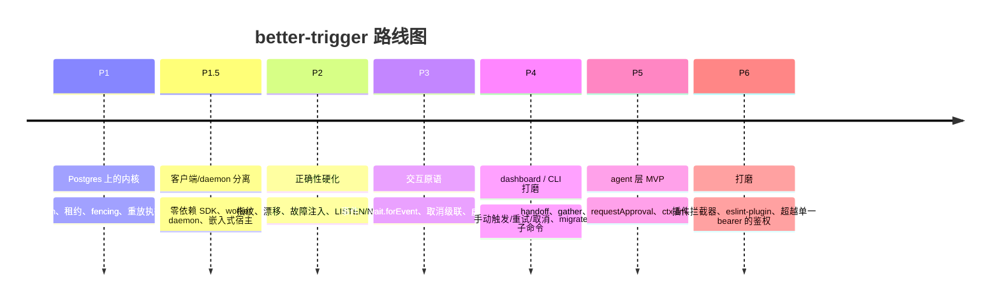

# 路线图

工程计划按 **P1–P6** 阶段跟踪在 [`docs/architecture.md`](https://github.com/zhy0216/better-trigger/blob/main/docs/architecture.md)。本页是公开摘要。

## 当前进度

**已实现并交付：**

- 基于位置 seq 的任务/step 重放
- 带 `FOR UPDATE SKIP LOCKED` 的队列、持久租约、单调 fencing token（step 历史 exactly-once）
- 带退避的重试 · 幂等键 · `AbortError`
- `ctx.wait.for` / `wait.until` 挂起-恢复
- `triggerAndWait`（父子）· `batchTrigger`（扇出）
- Cron 调度（基于数据库时钟）· 并发限制
- 崩溃恢复（`recoveries` 预算、`worker lost` 终态）
- 客户端/daemon 分离：零依赖 SDK 作为 HTTP 客户端
- 嵌入式宿主（`createEmbeddedRuntime`）
- Step 指纹 + 漂移检测（`replay: 'lenient' | 'strict'`）
- 代码版本盖章 + `--pin-code-version`（滞留 run 检测）
- 通知快路径（`pg_notify` 在 `bt` 频道上）
- 保留 / prune · 健康检查 + Prometheus 指标 · 内置 dashboard
- 一整套验收套件（e2e、fencing、replay-drift、crash、worker-lost、rolling-deploy、migration、notify……）在每次 PR 上运行

## 阶段

### P2 —— 正确性硬化（进行中）

指纹 + `NonDeterminismError` 已交付，`LISTEN/NOTIFY` 唤醒也已交付（`bt` 频道上的 `pg_notify`，即上方清单里的通知快路径）。剩余：

- 在每个持久化边界的崩溃 / 故障注入 harness（throw / abort / 连接断开 / 重复投递）

**今日的唤醒代价**——通知只是快路径、只是延迟优化：下面每条路径都保留轮询兜底，丢一条通知最多贵一个轮询周期，永不影响正确性。

| 路径 | 快路径 + 轮询兜底 |
|---|---|
| trigger → 开始执行 | `work` 通知唤醒 claim 循环；否则空闲槽退避 300ms → 2s（带 jitter） |
| `handle.result()` | `terminal` 通知一次结算该 run 的全部等待者；否则每个 daemon 一个共享 1s 扫描（原来是每等待者约 4 QPS） |
| wait 到期唤醒 | 全局上限 50 次/秒（1s tick、`LIMIT 50`、phase 1 无锁扫描）；它产生的重新入队会发一条 `work` 通知 |
| cron 触发 | 50 次/秒，随 daemon 数线性放大（`SKIP LOCKED`）；每次触发发一条 `work` 通知 |

### P3 —— 交互原语

`event()` / `emit` / `wait.forEvent`（写入与唤醒原子、离线不丢、恰好消费一次）、取消级联（父 → 子）、`batchTriggerAndWait`（扇出/扇入）、testing 包里的虚拟时间。

### P4 —— dashboard / CLI 打磨

REST 面上已有手动触发/重试/取消；`migrate` 子命令与进一步打磨。

### P5 —— agent 层 MVP

第一批**刻意只做三个连接点 + 一个 step 类型**（构建在 signal/event 内核上）：

- `ctx.handoff`（受控移交）
- `ctx.gather`（基于 `batchTriggerAndWait` 的扇出/扇入）
- `ctx.requestApproval`（基于 `wait.forEvent` 的人工审批）
- `ctx.llm`（记忆化 LLM step——重放绝不重新调用模型）
- `continueAsNew`（agent 长循环，避免 step 账本无界增长）

**北极星 demo：** planner 扇出 3 个 researcher → `gather` → 人工审批 → writer 产出。在任意边界 `kill -9` daemon；重启后 LLM 绝不重复计费、审批不丢、历史无重复 step、结果正确。

### P6 —— 打磨

插件拦截器（client/step/worker/persistence 四类）、确定性 eslint-plugin、运行中状态查询，以及超越单一 bearer key 的鉴权。

## 贯穿所有阶段的 5 条设计原则

1. SDK 始终是零依赖 HTTP 客户端——它从不打开数据库。
2. Postgres 是 v1 唯一基础设施；repository 是模块边界，不是公开 adapter API。
3. 按 step 记忆重放（位置 seq + 记忆化结果）——不是 event-history 或快照。
4. dashboard 由 daemon 亲自托管。
5. agent 原语是建立在 signal/event 内核之上的产品层。
